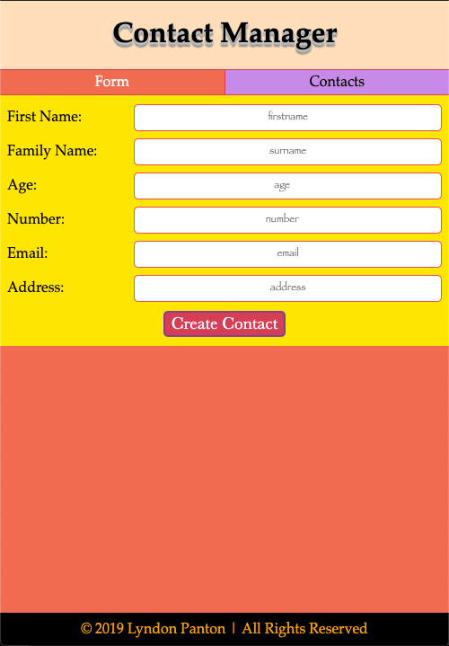
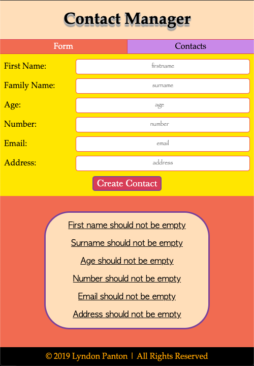
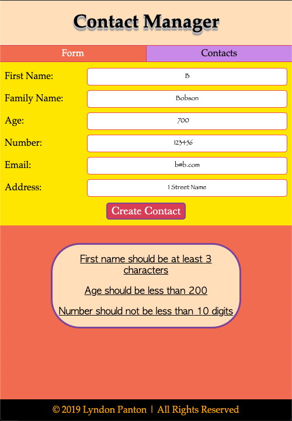
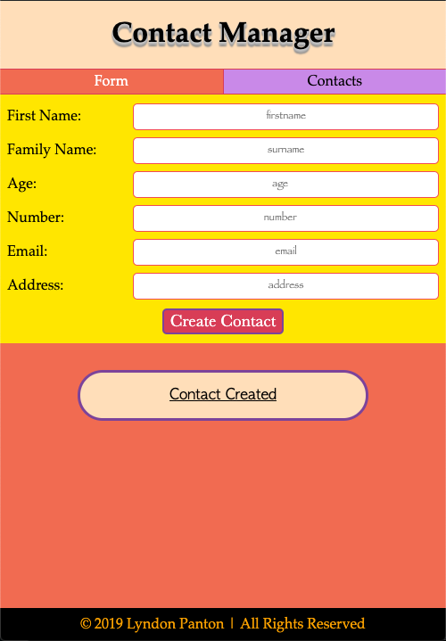
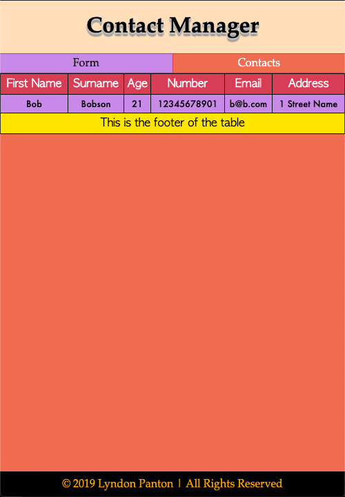

# Contact Manager

## How To Open
> 1. Open the project's download folder
> 2. Right click on the file name _index.html_
> 3. Choose the _open with_ option
> 4. Open the project in a browser of your choice

## How To Use
> 1. Fill out the form with the desired contact's details
> 2. The validation will return a message if you need to make any changes
> 3. Click on the contacts tab
> 4. The contact's details should now be in the table

## Requirements
> 1. The project requires a browser to run
> 2. The browser must have javascript available and enabled

## Extra Information
> 1. This project was made for the w3c and Microsoft's JavaScript Introduction course

## Preview

